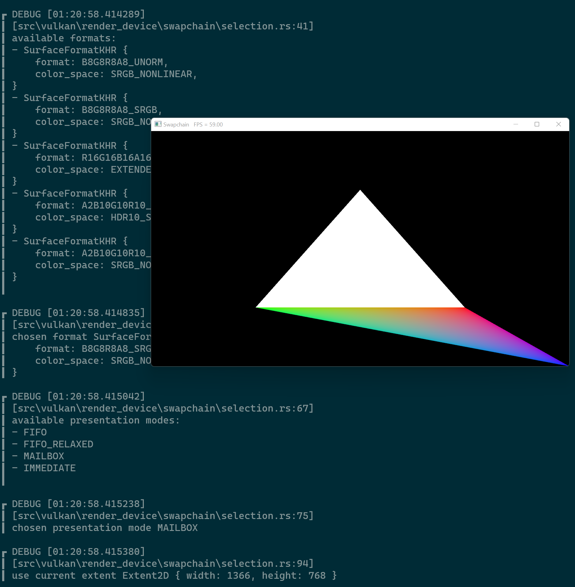

# Renderers

This example uses a single multisample render pass to clear the screen.


## Usage

```
cargo run --example e0
```

## Keybinds

* `Esc` - exit
* `Space + Ctrl` - toggle fullscreen

## Screenshot


