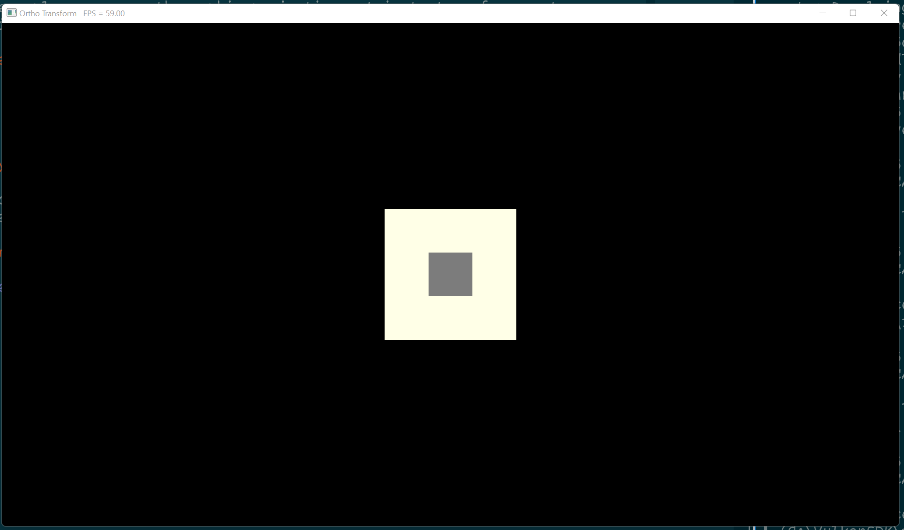

# Ortho Transform + Depth Testing

This example uses an orthographic projection matrix to transform vertex
coordinates. It also enables depth-testing for things at different z-depths.

## Usage

```
cargo run --example e1
```

## Keybinds

* `Esc` - exit
* `Space + Ctrl` - toggle fullscreen

## Screenshot


