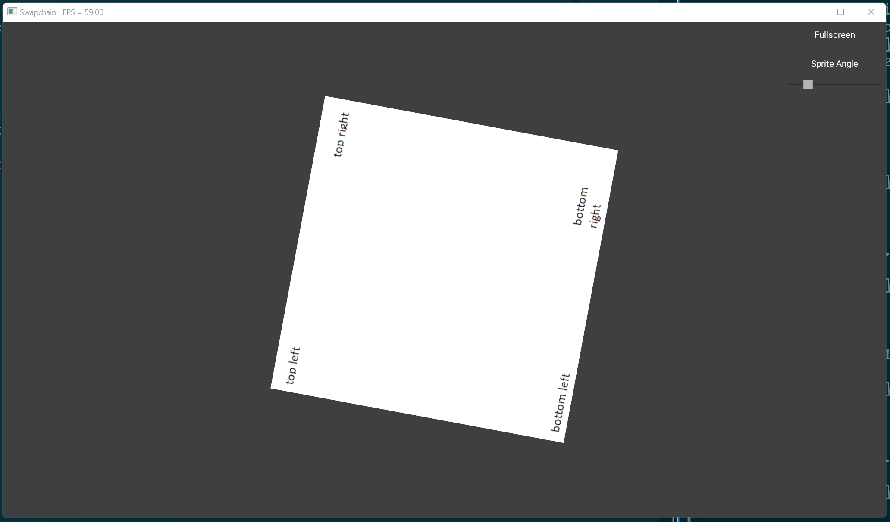

# Application Structure

This example uses the application structure defined in the demo module. This
removes a bunch of the GLFW boilerplate and lets the app jump straight into
rendering graphics.

## Usage

```
cargo run --example e3
```

## Keybinds

* `Esc` - exit
* `Space + Ctrl` - toggle fullscreen

## Screenshot


